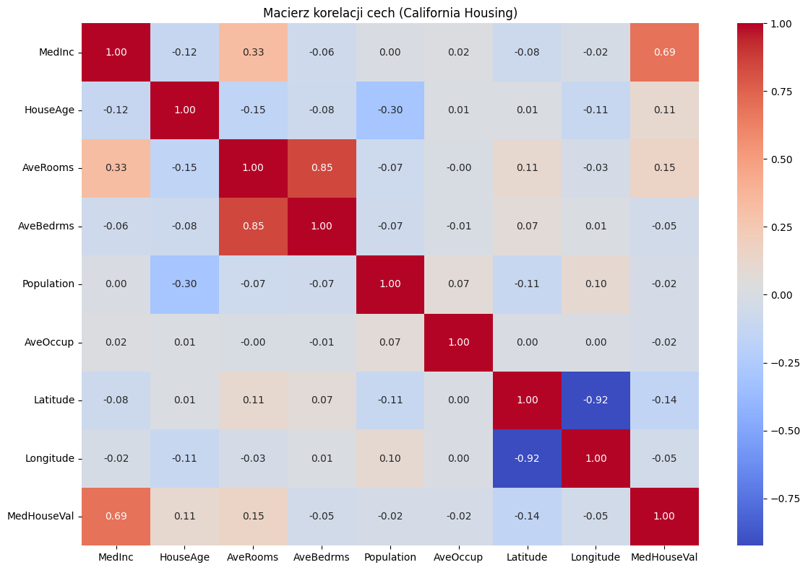
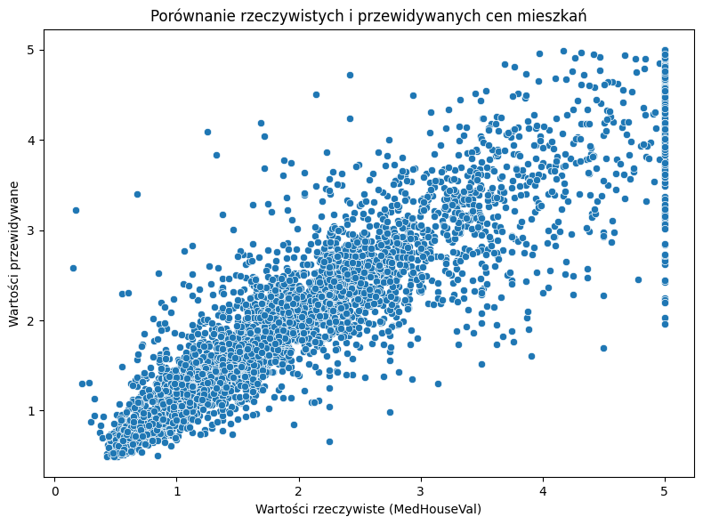

# 🧠 Projekt ML: Predykcja cen mieszkań (California Housing)

🇵🇱 Polski | [🇬🇧 English version](README_en.md)

Projekt regresji wykonany w ramach nauki uczenia maszynowego – przewidywanie cen mieszkań w Kalifornii na podstawie danych demograficznych i geograficznych.

---

## 📌 Cel projektu

Zbudowanie modelu regresji, który na podstawie danych wejściowych (np. średni dochód, liczba pokoi, lokalizacja) potrafi oszacować cenę mieszkania.

---

## 🗂️ Zbiór danych

- **California Housing Dataset** – dostępny w `scikit-learn`
- Zawiera informacje o:
  - Średnim dochodzie (`MedInc`)
  - Liczbie pokoi i sypialni
  - Gęstości zaludnienia
  - Położeniu (`Latitude`, `Longitude`)
  - `MedHouseVal` – mediana wartości domów (zmienna docelowa)

---

## 🧰 Użyte technologie i biblioteki

| Biblioteka | Zastosowanie |
|------------|--------------|
| `pandas`, `numpy` | manipulacja i analiza danych |
| `matplotlib`, `seaborn` | wizualizacja danych |
| `scikit-learn` | model Random Forest, metryki, przetwarzanie danych |

---

## ⚙️ Przebieg projektu

1. Wczytanie i analiza danych
2. Wizualizacja zależności (macierz korelacji)
3. Podział danych i standaryzacja
4. Trenowanie modelu `RandomForestRegressor`
5. Predykcja i porównanie z rzeczywistymi wartościami
6. Ocena modelu – metryki: MAE, R²

---

## 📈 Wyniki

- **MAE (Mean Absolute Error):** ~0.5  
- **R² Score:** ~0.8  
Model dobrze odwzorowuje dane testowe i nadaje się do praktycznych zastosowań.

---

## 🖼️ Przykładowe wizualizacje

### 📊 Macierz korelacji

### 📈 Predykcja vs rzeczywistość

---

## 📁 Pliki w repozytorium

| Plik | Opis |
|------|------|
| `mieszkania_california.py` | Skrypt do uruchomienia lokalnie |
| `projekt_california_colab.ipynb` | Notebook gotowy do Google Colab |
| `README.md` | Opis projektu po polsku |
| `README_en.md` | English version |
| `images/` | Folder z wykresami |
| `requirements.txt` | Lista bibliotek do instalacji

---

## 👨‍💻 Autor

**Kacper Kabak**  
Student zainteresowany sztuczną inteligencją, analizą danych i Pythonem.

---

## 🔧 Możliwe usprawnienia

- Grid Search / Random Search do tunowania modelu
- Porównanie z innymi modelami (XGBoost, Gradient Boosting)
- Wykorzystanie innych zbiorów danych (np. Ames Housing)

---

## ✅ Status projektu

✔️ Zakończony i gotowy do prezentacji / publikacji
