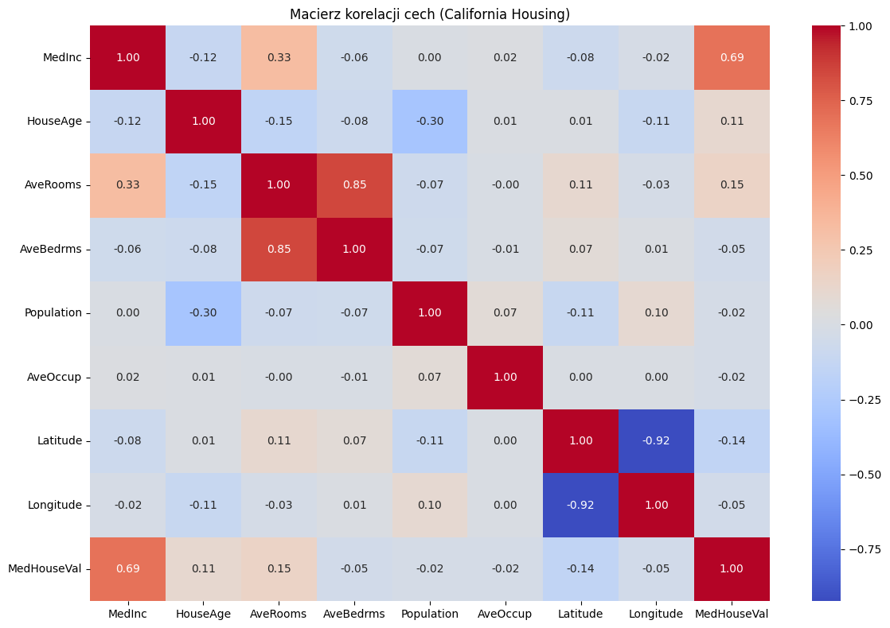
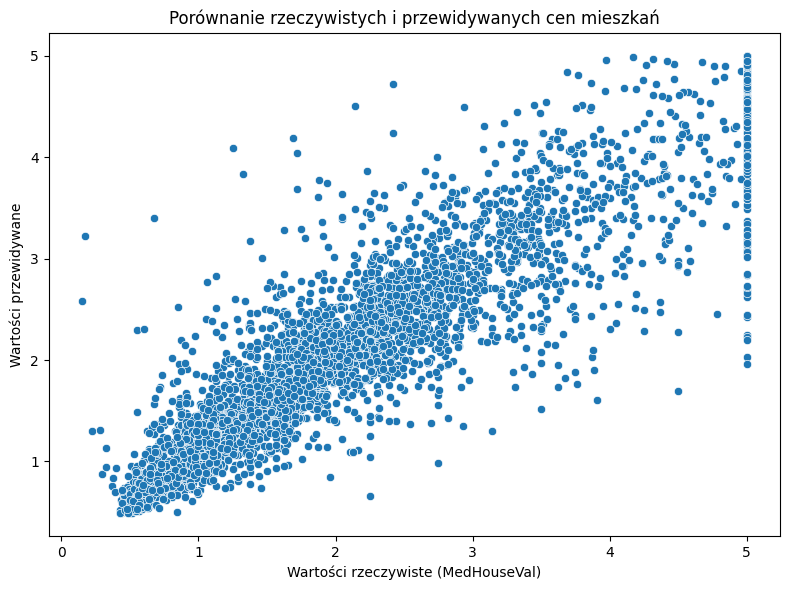

# 🧠 ML Project: House Price Prediction (California Housing)

This machine learning project focuses on building a regression model to predict house prices in California based on demographic and geographic features.

---

## 📌 Project Objective

To create a regression model that can estimate median house prices using data such as average income, number of rooms, location coordinates, and population density.

---

## 🗂️ Dataset

- **California Housing Dataset** – included in `scikit-learn`
- Contains features such as:
  - Median income (`MedInc`)
  - Number of rooms and bedrooms
  - Population and housing density
  - Geographical coordinates (`Latitude`, `Longitude`)
  - Target column: `MedHouseVal` (median house value in thousands)

---

## 🧰 Tools and Libraries

| Library | Purpose |
|---------|---------|
| `pandas`, `numpy` | Data manipulation and analysis |
| `matplotlib`, `seaborn` | Data visualization |
| `scikit-learn` | Data splitting, preprocessing, modeling (Random Forest), and evaluation |

---

## ⚙️ Workflow

1. **Load and explore the dataset**
2. **Visualize relationships (correlation matrix)**
3. **Train/test split and data scaling**
4. **Train a `RandomForestRegressor` model**
5. **Predict on test data and compare**
6. **Evaluate using metrics:**
   - Mean Absolute Error (MAE)
   - R² Score

---

## 📈 Model Performance

- **Mean Absolute Error (MAE):** ~0.5
- **R² Score:** ~0.8  
The model performs well and generalizes effectively on unseen data.

---

## 📊 Visualizations

### 🔹 Correlation Matrix
Shows which features have the strongest impact on house prices.

---

### 🔹 Predicted vs Actual Prices
Visual comparison of predicted and true values.

---

## 📁 Files in the Repository

| File | Description |
|------|-------------|
| `mieszkania_california.py` | Python script – local version |
| `projekt_california_colab.ipynb` | Jupyter Notebook – Colab-ready |
| `README.md` | Project documentation |
| `images/` | Folder with visualization screenshots |

---

## 👨‍💻 Author

**Kacper Kabak**  
Student exploring machine learning, artificial intelligence, and data analysis.

---

## 🚀 Possible Improvements

- Hyperparameter tuning (GridSearchCV, RandomizedSearchCV)
- Model comparison with XGBoost, GradientBoosting
- Using other datasets (e.g., Ames Housing)

---

## ✅ Project Status

✔️ Finished and ready to present or publish.
